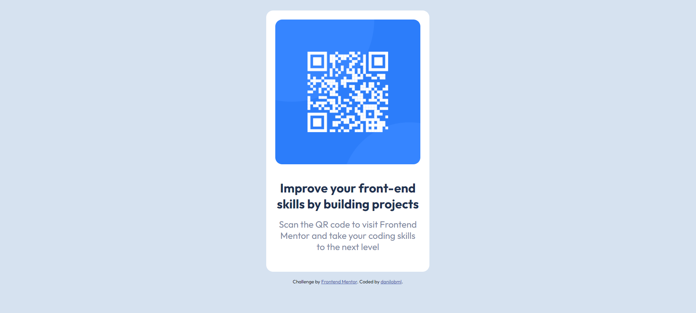
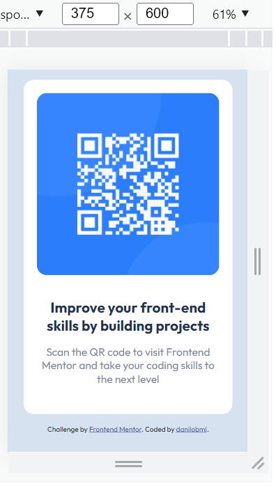

# Frontend Mentor - QR code component solution

This is a solution to the [QR code component challenge on Frontend Mentor](https://www.frontendmentor.io/challenges/qr-code-component-iux_sIO_H). Frontend Mentor challenges help you improve your coding skills by building realistic projects. 

## Table of contents

- [Overview](#overview)
  - [Screenshot](#screenshot)
  - [Links](#links)
- [My process](#my-process)
  - [Built with](#built-with)
  - [What I learned](#what-i-learned)
  - [Continued development](#continued-development)
  - [Useful resources](#useful-resources)
- [Author](#author)
- [Acknowledgments](#acknowledgments)

## Overview
My solution to the challenge. I'm a complete beginner to HTML, CSS, and coding in general. I'd really appreciate your inputs and constructive criticism. 

### Screenshot

### Links

- Solution URL: (https://danilobml.github.io/qrcode/)

## My process

### Built with

- Semantic HTML5 markup
- CSS custom properties
- Flexbox
- Mobile-first workflow

### What I learned

I did this as an attempt to apply my still pretty poor knowledge of HTML and CSS. I've just started learning to code, for less than a month at this point.

What I did is based on examples and ideas I've learned from my classes at the WBS Coding School Berlin.

Pretty much everything is a new thing I'm learning :)

Examples: learning how to use the external font-family (Outfit).

*Applying media queries - This is still difficult for me and I'm still uncertain if what I did is correct (maybe someone could give me a feedback)...

### Continued development

CSS flexbox positioning, especially responsive, is still pretty hard for me. I need to do many more exercises and projects like this.

### Useful resources

- [W3](https://www.w3schools.com/) - This helped me to understand how to link to an external font-family.
- [Stack Overflow](https://stackoverflow.com) - They have tips to solve a lot of coding problems. It was especially useful for positioning with flexbox. 

## Author

- Website - [danilobml](https://github.com/danilobml)

## Acknowledgments

I'd like to thank Ben fom WBS coding school! He is a great teacher!